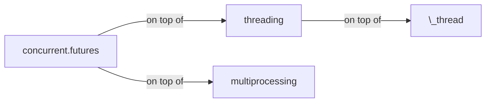
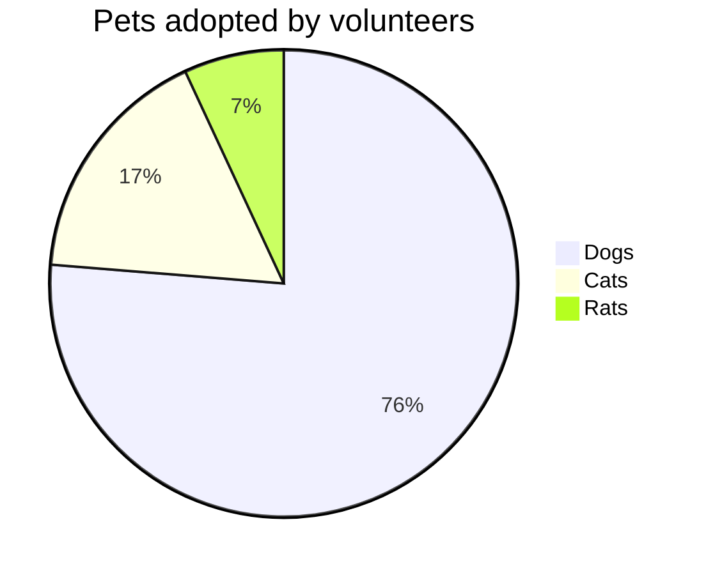
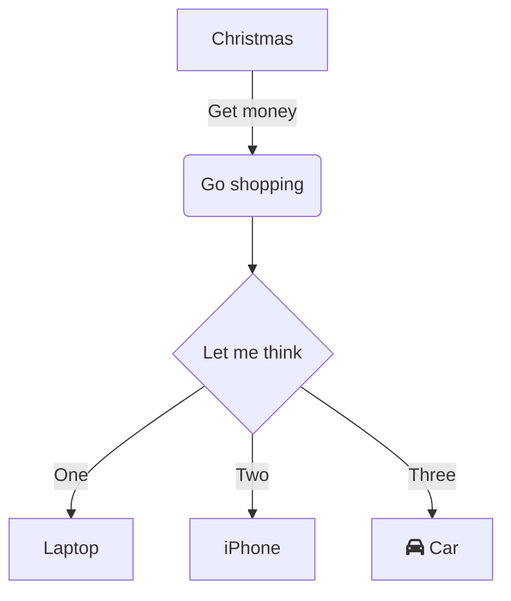
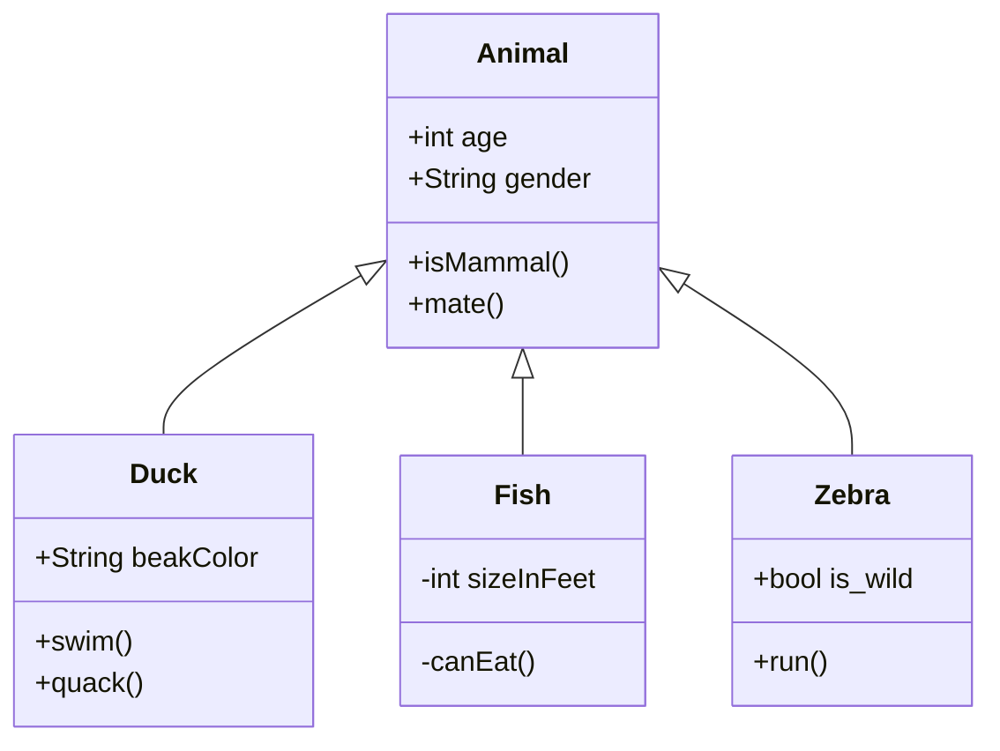
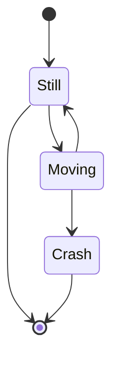

<!-- --- 배너 없이 이렇게만 하면 글씨만 제목에 들어감. 사진X
layout: post
title: Test markdown
subtitle: Each post also has a subtitle
categories: markdown
tags: [test, blog]
--- -->

새로운 포스트를 추가하려면, _posts 디렉토리에 YYYY-MM-DD-name-of-post.ext 형식을 따르는 파일을 추가

## Code Chunk


def print_hi(name)
puts "Hi, #{name}"
end
print_hi('Tom')
#=> prints 'Hi, Tom' to STDOUT.


```cpp
#include <iostream>
using namespace std;

int main() {
  cout << "Hello World!";
  return 0;
}
// prints 'Hi, Tom' to STDOUT.
```

```python
class Person:
  def __init__(self, name, age):
    self.name = name
    self.age = age

p1 = Person("John", 36)

print(p1.name)
print(p1.age)
```

~~~
var foo = function(x) {
  return(x + 5);
}
foo(3)
~~~

And here is the same code with syntax highlighting:

```javascript
var foo = function(x) {
  return(x + 5);
}
foo(3)
```

And here is the same code yet again but with line numbers:


var foo = function(x) {
  return(x + 5);
}
foo(3)


## 활용법

활용법은 다음 문서 확인: [Jekyll docs][jekyll-docs]
마크다운 배우는 곳: [markdown](https://markdowntutorial.com/)

[jekyll-docs]: https://jekyllrb.com/docs/home

## Math

Put the math expression within <span>$</span>...\$

$ a \* b = c ^ b $

$ 2^{\frac{n-1}{3}} $

$ \int_a^b f(x)\,dx. $

\\(\LaTeX{}\\)

$\Pi$

$ 2^{\frac{n-1}{3}} $

$ \int\_a^b f(x)\,dx. $

\\( \int\_a^b f(x)\,dx. \\)

## Bold
**bold text**

## Inline
\`escape inline code\`  
`inline code`

## quote
> 인용구

## Picture
How about a yummy crepe?
It can also be centered!

{: .center-block :}

### Emoji

This single quote code `inet:email:message:to` will not be parsed to emoji icon
:+1:. :bolivia:

<!-- ## Boxes 얘네 박스들 왜 안되는지 ㅁㄹ겠는데 표시가 안됨
You can add notification, warning and error boxes like this:

### Notification

{: .box-note}
**Note:** This is a notification box.

### Warning

{: .box-warning}
**Warning:** This is a warning box.

### Error

{: .box-error}
**Error:** This is an error box. -->

## Table

| Number | Next number | Previous number |
| :------ |:--- | :--- |
| Five | Six | Four |
| Ten | Eleven | Nine |
| Seven | Eight | Six |
| Two | Three | One |

|   1   |  2     |   3   |   4   |  5   |  6   |  7  |
| spancell1     ||   spancell2  || cell | spancell3 ||
|^^ spancell1   ||   spancell2  || cell | spancell3 ||
{:class="custom-table"}

<script>
|:-----:|:-----:|:-----:|:-----:|
| (0,0) | (0,1) | (0,2) | (0,3) |
|     (1,0)    || ^^    | (1,3) |
</script>


|:-----:|:-----:|:-----:|:-----:| ---- |
| (0,0) | (0,1) | (0,2) | (0,3) |      |
|     (1,0)    || ^^    | (1,3) |      |


|:-----:|:-----:|:-----:|:-----:| ---- |
| (0,0) | (0,1) | (0,2) | (0,3) |      |
|     (1,0)           ||| (1,3)       ||


|:-----:|:-----:|:-----:|:-----:| ---- |
| (0,0) | (0,1) | (0,2) | (0,3) |      |
|     (1,0)           ||| ^^    |      |

|:-----:|:-----:|:-----:|:-----:| ---- |
| (0,0) | (0,1) | (0,2) | (0,3) |      \
|     (1,0)           ||| ^^    |      |


| Stage | Direct Products | ATP Yields |
| ----: | --------------: | ---------: |
|Glycolysis | 2 ATP                   ||
|^^         | 2 NADH      | 3--5 ATP   |
|Pyruvaye oxidation | 2 NADH | 5 ATP   |
|Citric acid cycle  | 2 ATP           ||
|^^                 | 6 NADH | 15 ATP  |
|^^                 | 2 FADH | 3 ATP   |
|                        30--32 ATP  |||


{:color-style: style="background: black;" }
{:color-style: style="color: white;" }
{:font-style: style="font-weight: 900; text-decoration: underline;" }

|:             Here's a Inline Attribute Lists example                 :||||
| ------- | ------------------------- | -------------------- | ----------- |
|:       :|:  <div style="color: red;"> &lt; Normal HTML Block > </div> :|||
| ^^      |   Red    {: .cls style="background: orange" }                |||
| ^^ IALs |   Green  {: #id style="background: green; color: white" }    |||
| ^^      |   Blue   {: style="background: blue; color: white" }         |||
| ^^      |   Black  {: color-style font-style}                          |||


[cell image]: https://jekyllrb.com/img/octojekyll.png "An exemplary image"

| Heading            | Column 1      | Column 2                           |
|--------------------|---------------|------------------------------------|
| Row 1              | Apple[^1]     | [Youtube (Home)]                   |
| Row 2              | Banana        | [Github][1]                        |
| Row 3 (merged)     | Blueberry     | [Google] *****  [Github]           |
| ^^         | [Plum](https://example.com) | Raspberry ![example][cell image]   |
| Row 4      | <https://www.google.com>    |  [test](https://www.google.com){:target="_blank"}                            |
|^^          |^^ <https://www.youtube.com> |                              |
| Row 5      | <https://www.google.com>                                  ||

[Youtube (Home)]: https://www.youtube.com
[Google]: https://www.google.com
[Github]: https://www.github.com
[1]: https://www.github.com
[^1]: Footnote

<https://www.google.com>

Not in table: `<Mail Gateway>`

In table:

Decision Point | Design Decision
--- | ---
Authoritative DNS MX Record | `<Mail Gateway>`

9 \* 9

| 1 \* 1 = 1 |
| 1 \* 2 = 2 | 2 \* 2 = 4 |
| 1 \* 3 = 3 | 2 \* 3 = 6 | 3 \* 3 = 9  |
| 1 \* 3 = 3 | 2 \* 3 = 6 | 3 \* 4 = 12 | 4 \* 4 = 16 |

## Table example as below

**For now, these extended features are provided:**

* Cells spanning multiple columns
* Cells spanning multiple rows
* Cells text align separately
* Table header not required
* Grouped table header rows or data rows

### Rowspan and Colspan
^^ in a cell indicates it should be merged with the cell above.  
This feature is contributed by [pmccloghrylaing](https://github.com/pmccloghrylaing).  

| Stage | Direct Products | ATP Yields |
| ----: | --------------: | ---------: |
|Glycolysis | 2 ATP                   ||
|^^         | 2 NADH      | 3--5 ATP   |
|Pyruvaye oxidation | 2 NADH | 5 ATP   |
|Citric acid cycle  | 2 ATP           ||
|^^                 | 6 NADH | 15 ATP  |
|^^                 | 2 FADH | 3 ATP   |
| 30--32 ATP                         |||

[ Net ATP yields per hexose]

### Multiline
A backslash at end to join cell contents with the following lines.  
This feature is contributed by [Lucas-C](https://github.com/Lucas-C).

|:     Easy Multiline     :|||
|:------ |:------ |:-------- |
| Apple  | Banana |  Orange  \
| Apple  | Banana |  Orange  \
| Apple  | Banana |  Orange
| Apple  | Banana |  Orange  \
| Apple  | Banana |  Orange  |
| Apple  | Banana |  Orange  |


### Headerless
Table header can be eliminated.

|--|--|--|--|--|--|--|--|
|♜ |  |♝ |♛ |♚ |♝ |♞ |♜ |
|  |♟ |♟ |♟ |  |♟ |♟ |♟ |
|♟ |  |♞ |  |  |  |  |  |
|  |♗ |  |  |♟ |  |  |  |
|  |  |  |  |♙ |  |  |  |
|  |  |  |  |  |♘ |  |  |
|♙ |♙ |♙ |♙ |  |♙ |♙ |♙ |
|♖ |♘ |♗ |♕ |♔ |  |  |♖ |


```markdown
|:     Fruits \|\| Food           :|||
|:-------- |:-------- |:------------ |
| Apple    |: Apple  :|    Apple     \
| Banana   |  Banana  |    Banana    \
| Orange   |  Orange  |    Orange    |
|:   Rowspan is 5   :||:  How's it? :|
|^^   A. Peach       ||^^ 1. Fine    |
|^^   B. Orange      ||^^ 2. Bad  $I = \int \rho R^{2} dV$     |
|^^   C. Banana      ||   It's OK! ![example image][my-image]  |
```

### Text Alignment
Table cell can be set alignment separately.

| \:Fruits         ||  Food   :|
|:-------- |:------ |:-------- |
| Apple    | Banana |  Orange  |
| Apple    | Banana |  Orange  |


|          | Fruits\::        ||
|:-------- |:------ |:-------- |
| Apple    | Banana |  Orange  |
| Apple    | Banana |  Orange  |


|: \:Fruits       :||          |:       Food     :||
|:-------- |:------ |:-------- |:-------- |:------ |
| Apple    | Banana |  Orange  |:   Strawberry    :|
| Apple  &  Banana || ^^       |    Peach        :||


|: \:Fruits       :||          |:       Food     :||
| Apple    | Banana |  Orange  |:   Strawberry    :|


## Table Tips
열을 구분하기 위해 파이프 (|)를 사용하고, 헤더 행과 표의 나머지 부분을 구분하기 위해 대시(-)를 사용하자.
마크다운 프로세서에게 공백은 중요하지 않다. 모든 추가 공백은 제거되지만, 가독성을 높이는 데에는 도움이 될 수 있다.
아래의 두 마크다운 예시는 모두 같은 표를 생성한다.

열을 구분하기 위해 파이프 `(`|`)` 를 사용하고, 헤더 행과 표의 나머지 부분을 구분하기 위해 대시(-)를 사용하자.

## My First PlantUML

### PlantUML Block-1
@startuml
Bob -> Alice : hello
@enduml


### PlantUML Block-2
``` plantuml!
Bob -> Alice : hello world
```


### PlantUML Block-3
@startuml
(*) --> "Initialization"

if "Some Test" then
  -->[true] "Some Activity"
  --> "Another activity"
  -right-> (*)
else
  ->[false] "Something else"
  -->[Ending process] (*)
endif
@enduml


### PlantUML Block-4

@startuml
skinparam handwritten true

skinparam usecase {
  BackgroundColor DarkSeaGreen
  BorderColor DarkSlateGray

  BackgroundColor<< Main >> YellowGreen
  BorderColor<< Main >> YellowGreen

  ArrowColor Olive
  ActorBorderColor black
  ActorFontName Courier

  ActorBackgroundColor<< Human >> Gold
}

User << Human >>
:Main Database: as MySql << Application >>
(Start) << One Shot >>
(Use the application) as (Use) << Main >>

User -> (Start)
User --> (Use)

MySql --> (Use)

@enduml

## Mermaid


## Mermaid example

### 1. Pie chart



### 2. sequence diagram

@startmermaid
sequenceDiagram
  Alice ->> Bob: Hello Bob, how are you?
  Bob-->>John: How about you John?
  Bob--x Alice: I am good thanks!
  Bob-x John: I am good thanks!
  Note right of John: Bob thinks a long<br/>long time, so long<br/>that the text does<br/>not fit on a row.
  
  Bob-->Alice: Checking with John...
  Alice->John: Yes... John, how are you?
@endmermaid



### 3. Class diagram


### 4. State diagram


## Video


[\[video link\]](//www.youtube.com/watch?v=Ptk_1Dc2iPY)

## Audio

[HTML5 Audio Formats Test](https://hpr.dogphilosophy.net/test/)

"MP3" file (".mp3") :


Ogg Vorbis (".ogg") :


"wave" file(".wav") :

